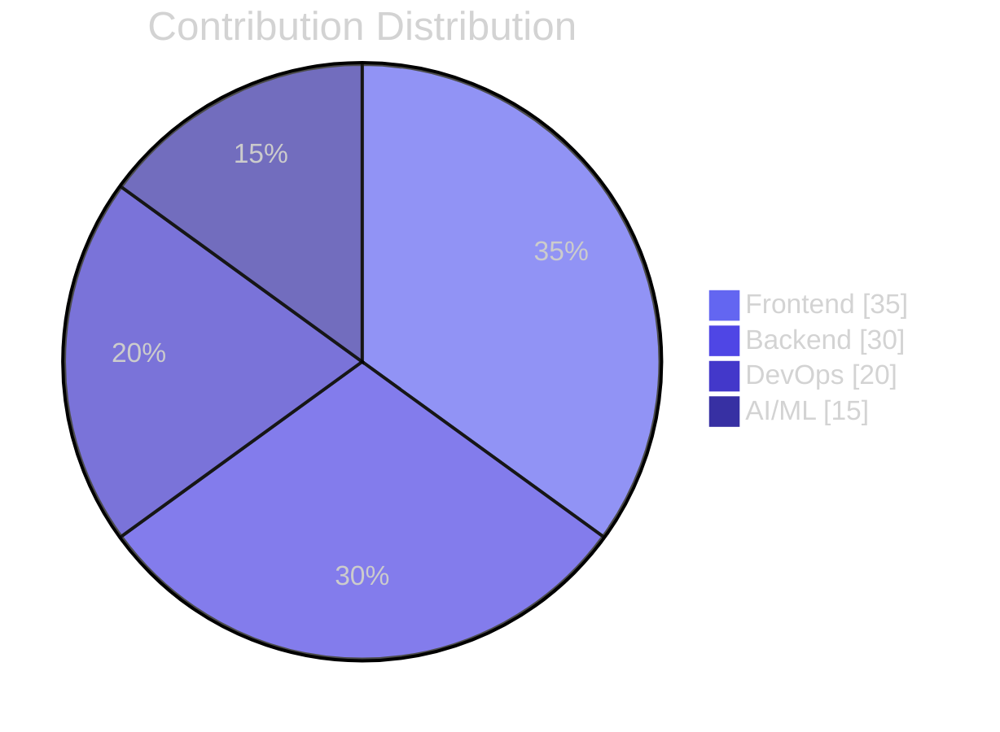
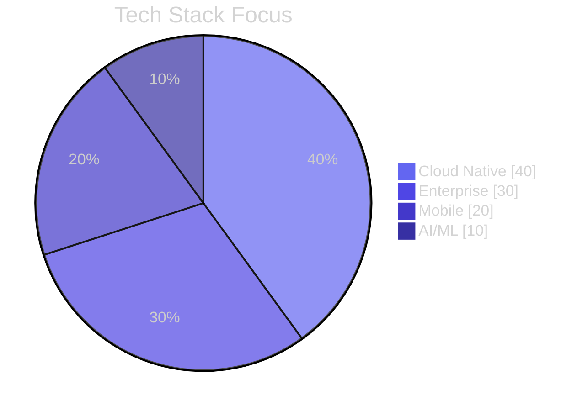
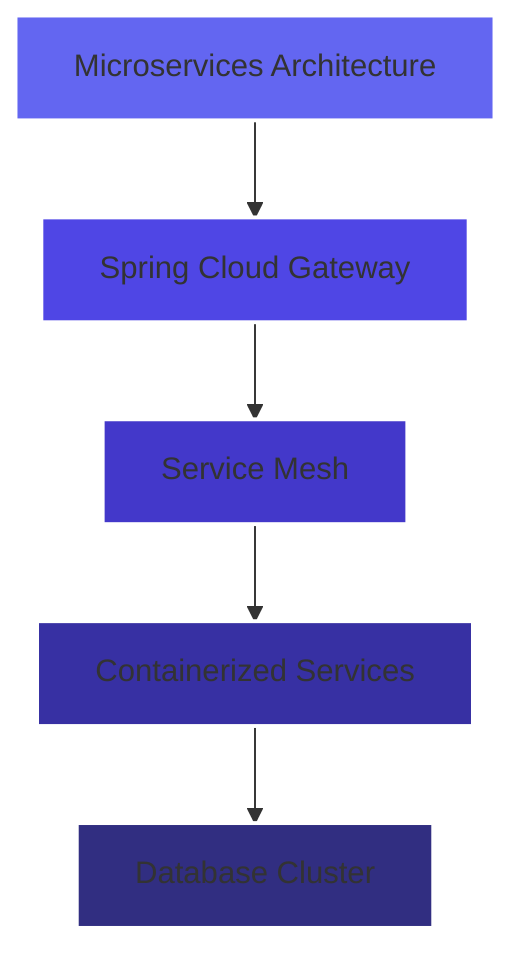
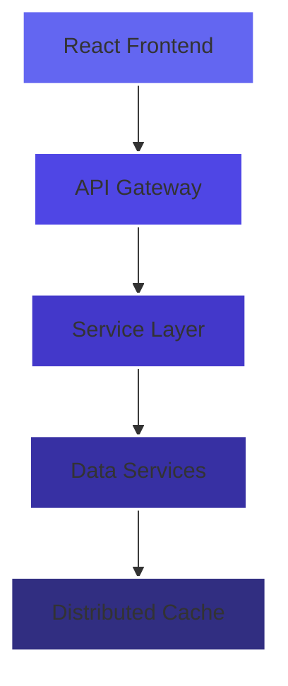

<div align="center">


<a href="https://git.io/typing-svg"></a>
</div>


<div align="center">


<a href="https://git.io/typing-svg"></a>

[](https://github.com/chamathdilshanc)
[](https://github.com/chamathdilshanc)
[](https://github.com/chamathdilshanc)

</div>

<br>

## `$ whoami`

```typescript
interface TechInnovator {
    name: string;
    role: string;
    location: string;
    worksWith: string[];
    expertise: {
        frontend: string[];
        backend: string[];
        devops: string[];
        ai_ml: string[];
    };
    focuses: string[];
}

const chamathDilshan: TechInnovator = {
    name: "Chamath Dilshan",
    role: "Full Stack Engineer & Solution Architect",
    location: "Sri Lanka 🌏",
    worksWith: ["Enterprise Solutions", "Cloud Architecture", "AI Integration"],
    expertise: {
        frontend: ["React", "Next.js", "Flutter", "TailwindCSS"],
        backend: ["Spring Boot", "Node.js", "Express", "GraphQL"],
        devops: ["AWS", "Docker", "Kubernetes", "CI/CD"],
        ai_ml: ["TensorFlow", "PyTorch", "Data Analytics"]
    },
    focuses: [
        "Scalable Cloud Architecture",
        "Enterprise Software Solutions",
        "AI/ML Integration",
        "Performance Optimization"
    ]
};
```

<div align="center">

## 🏆 Engineering Excellence

[](https://github.com/chamathdilshanc)

### Performance Metrics

<table>
<tr>
<td>



</td>
<td>



</td>
</tr>
</table>

### Development Analytics

|  |  |
|---|---|
|  |  |

[](https://github.com/chamathdilshanc)

</div>

## 🎯 Signature Projects

<table>
<tr>
<td width="50%">

<h3 align="center">Sun & Moon Resort Enterprise Platform</h3>

<div align="center">


[View Project →](https://github.com/ChamathDilshanC/Sun-MoonResort_Project)



</div>
</td>
<td width="50%">

<h3 align="center">Next-Gen POS System</h3>

<div align="center">


[View Project →](https://github.com/ChamathDilshanC/Pos-System)



</div>
</td>
</tr>
</table>

## 🛠️ Engineering Arsenal

<div align="center">

### Core Expertise


### Cloud & DevOps


### Data & Analytics


</div>

## 📈 Engineering Metrics

<div align="center">

| Contribution Analytics | Technology Distribution |
|-------------------|----------------------|
|  |  |

</div>

## 🤝 Professional Network

<div align="center">

[](https://www.linkedin.com/in/chamath-dilshan-6aa8022ab/)
[](https://www.chamathdilshanc.com/)
[](mailto:dilshanColonne123@gmail.com)
[](https://github.com/chamathdilshanc)

</div>

```typescript
// Innovation through collaboration
const engineeringPhilosophy = {
    approach: "First Principles Thinking",
    methodology: "Agile & DevOps Practices",
    focus: [
        "Scalable Architecture",
        "Clean Code Principles",
        "Performance Optimization",
        "Security Best Practices"
    ],
    mission: "Delivering exceptional software solutions that drive business value"
};
```


