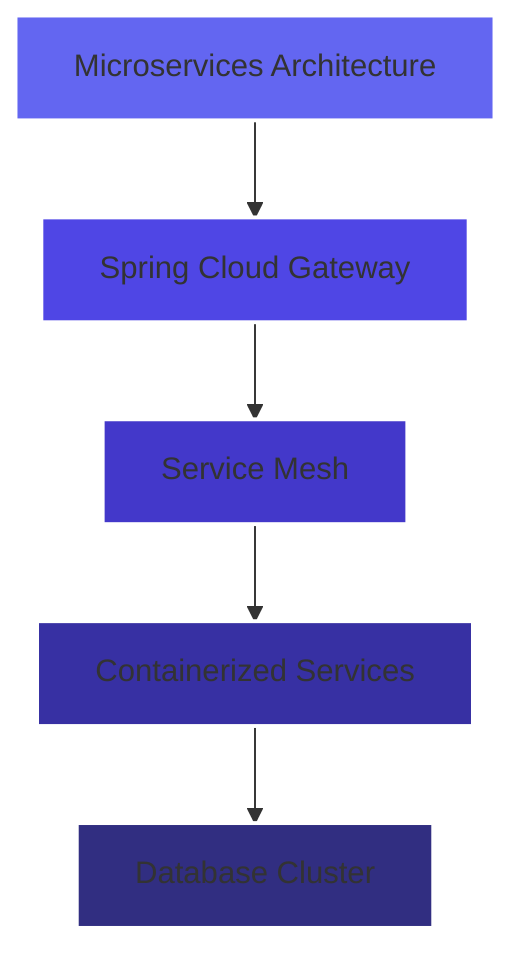
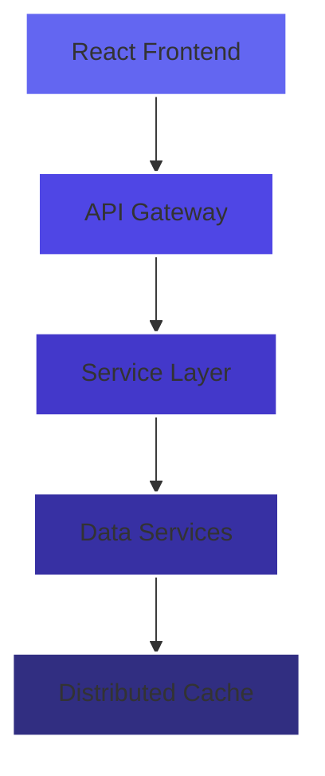

<div align="center">

<div align="center">


<a href="https://git.io/typing-svg"></a>


<!-- Animated view counter and badges with consistent styling -->
<p align="center">
  <a href="https://github.com/chamathdilshanc">
    
  </a>
  <a href="https://github.com/chamathdilshanc">
    
  </a>
  <a href="https://github.com/chamathdilshanc?tab=repositories">
    
  </a>
</p>

<!-- Animated glowing divider -->
<div align="center">
  
</div>

</div>
<br><br>

## `$ whoami` 
<div align="start">
    
```typescript
interface TechInnovator {
    name: string;
    role: string;
    location: string;
    worksWith: string[];
    expertise: {
        frontend: string[];
        backend: string[];
        devops: string[];
        ai_ml: string[];
    };
    focuses: string[];
}

const chamathDilshan: TechInnovator = {
    name: "Chamath Dilshan",
    role: "Full Stack Engineer & Solution Architect",
    location: "Sri Lanka 🌏",
    worksWith: ["Enterprise Solutions", "Cloud Architecture", "AI Integration"],
    expertise: {
        frontend: ["React", "Next.js", "Flutter", "TailwindCSS"],
        backend: ["Spring Boot", "Node.js", "Express", "GraphQL"],
        devops: ["AWS", "Docker", "Kubernetes", "CI/CD"],
        ai_ml: ["TensorFlow", "PyTorch", "Data Analytics"]
    },
    focuses: [
        "Scalable Cloud Architecture",
        "Enterprise Software Solutions",
        "AI/ML Integration",
        "Performance Optimization"
    ]
};
```
</div>
<br><br>

<div align="center">
  
</div>

<div align="center">
<br><br>

## 🏆 Engineering Excellence

<!-- Animated trophy display with clean layout -->
<p align="center">
  
</p>

<!-- Animated gradient cards -->
<div align="center">
  
</div>
<br><br>

## Development Analytics

<div style="display: flex; justify-content: center; gap: 10px; flex-wrap: wrap;">
  
  
</div>

<!-- Animated contribution graph with glowing effect -->
<a href="https://github.com/chamathdilshanc">
  
</a>

</div>

<div align="center">
  
</div>
<br><br>

## 🎯 Signature Projects

<table>
<tr>
<td width="50%">

<h3 align="center">Sun & Moon Resort Enterprise Platform</h3>

<div align="center">


[View Project →](https://github.com/ChamathDilshanC/Sun-MoonResort_Project)



</div>
</td>
<td width="50%">

<h3 align="center">Next-Gen POS System</h3>

<div align="center">


[View Project →](https://github.com/ChamathDilshanC/Pos-System)



</div>
</td>
</tr>
</table>

<div align="center">
  
</div>
<br><br>

##  Technology Arsenal

<div align="center">

<h3 align="center">🔥 Core Capabilities 🔥</h3>
<p>
  
  
  
  
  
  
</p>

<h3 align="center">⚡ Frontend Engineering ⚡</h3>
<p>
   
  
  
  
  
</p>

<h3 align="center">🧠 Backend Architecture 🧠</h3>
<p>
  
  
  
  
  
  
</p>

<h3 align="center">☁️ Cloud & DevOps ☁️</h3>
<p>
  
  
  
  
  
  
</p>

<h3 align="center">🤖 AI & Data 🤖</h3>
<p>
  
  
  
  
  
  
</p>

</div>
---
<br><br>


## 🤝 Professional Network 

<div align="center">

<a href="https://www.linkedin.com/in/chamath-dilshan-6aa8022ab/">
  
</a>
<a href="https://www.chamathdilshanc.com/">
  
</a>
<a href="mailto:dilshanColonne123@gmail.com">
  
</a>
<a href="https://github.com/chamathdilshanc">
  
</a>

<!-- Animated social media icons -->
<p align="center">
  <a href="https://www.linkedin.com/in/chamath-dilshan-6aa8022ab/">
    
  </a>
  <a href="mailto:dilshanColonne123@gmail.com">
    
  </a>
  <a href="https://github.com/chamathdilshanc">
    
  </a>
</p>

</div>

```typescript
// Innovation through collaboration
const engineeringPhilosophy = {
    approach: "First Principles Thinking",
    methodology: "Agile & DevOps Practices",
    focus: [
        "Scalable Architecture",
        "Clean Code Principles",
        "Performance Optimization",
        "Security Best Practices"
    ],
    mission: "Delivering exceptional software solutions that drive business value"
};
```


