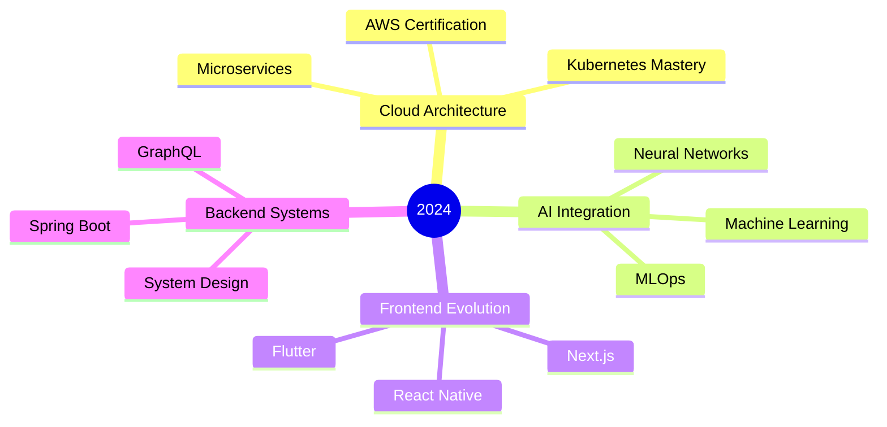

<div align="center">


<a href="https://git.io/typing-svg"></a>
<br><br>

[](https://github.com/chamathdilshanc)

</div>

## My Overview
```json
{
  "name": "Chamath Dilshan",
  "version": "2024.1.0",
  "role": "Full Stack Engineer",
  "location": "Sri Lanka",
  "current_focus": [
    "Cloud Native Applications",
    "AI/ML Integration",
    "Enterprise Solutions"
  ],
  "projects": {
    "main": "Sun & Moon Resort Platform",
    "status": "development",
    "progress": 75,
    "next_milestone": "Q2 2024"
  },
  "availability": {
    "collaborations": true,
    "open_source": true,
    "contact": "dilshanColonne123@gmail.com"
  }
}
```

## Tech Arsenal `~/stack.yaml`

<table>
<tr>
<td width="50%">

### Core Stack 🛠️
```yaml
languages:
  primary:
    - JavaScript/TypeScript
    - Java
    - Dart
    - C
  
frontend:
  frameworks:
    - React/Next.js
    - Flutter
    - HTML5/CSS3
  design:
    - Figma
    - TailwindCSS
    
backend:
  frameworks:
    - Spring Boot
    - Node.js/Express
    - Hibernate
  api:
    - REST
    - GraphQL
```

</td>
<td width="50%">

### Infrastructure ⚡
```yaml
cloud:
  providers:
    - AWS
    - Firebase
  containers:
    - Docker
    - Kubernetes
    
databases:
  sql:
    - PostgreSQL
    - MySQL
  nosql:
    - MongoDB
    - Firebase
    
tools:
  ide:
    - VS Code
    - IntelliJ IDEA
  version_control:
    - Git/GitHub
  ci_cd:
    - GitHub Actions
```

</td>
</tr>
</table>

## System Metrics `~/stats.sh`

<div align="center" style="display: flex; justify-content: center; align-items: center; flex-wrap: wrap; gap: 10px;">


</div>

## Project Matrix `~/projects.md`

| Project | Stack | Status | Progress |
|:--------|:------|:-------|:---------|
| **🏢 Sun & Moon Resort** | `Next.js` `Spring` `AWS` | `ACTIVE` |  |
| **🤖 AI Analytics Hub** | `React` `TensorFlow` `Python` | `IN DEV` |  |
| **📱 Mobile App Suite** | `Flutter` `Firebase` | `PLANNING` |  |

## Development Focus `~/roadmap.mmd`



## Featured Work `~/portfolio.ts`

<div align="center">

[](https://github.com/ChamathDilshanC/Sun-MoonResort_Project)
[](https://github.com/ChamathDilshanC/Pos-System)

</div>

## Skill Matrix `~/skills.log`

<div align="center">

| Domain | Experience Level |
|:-------|:----------------|
| **☁️ Cloud & DevOps** |  |
| **💻 Full Stack** |  |
| **📱 Mobile Dev** |  |
| **🤖 AI/ML** |  |
| **🎨 UI/UX** |  |

</div>

## Connect `~/socials.sh`

<div align="center">

[](https://www.linkedin.com/in/chamath-dilshan-6aa8022ab/)
[](https://www.facebook.com/chamath.colonne.9/)
[](https://instagram.com/chamath_dilshan_c/)
[](mailto:dilshanColonne123@gmail.com)

```javascript
// Contact for collaboration
const contact = {
    email: "dilshanColonne123@gmail.com",
    availability: "Open to exciting projects and opportunities",
    interests: ["AI/ML", "Cloud Native", "Mobile Apps", "Innovation"]
};
```

</div>


