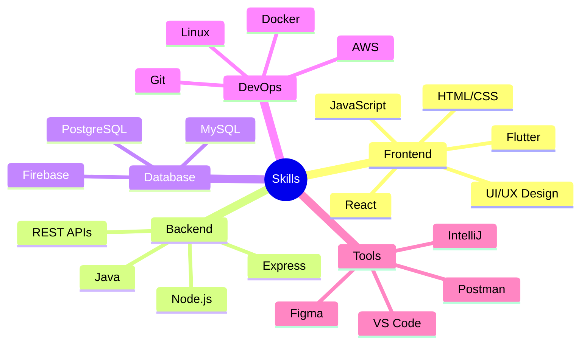

<div align="center">


[](https://git.io/typing-svg)

[](https://github.com/chamathdilshanc)
[](mailto:dilshanColonne123@gmail.com)
[](https://www.linkedin.com/in/chamath-dilshan-6aa8022ab/)

</div>

## 🎯 Technical Arsenal

<div align="center">

<!-- Programming Languages -->
<details open>
<summary><b>🛠️ Programming Languages</b></summary>
<br>

</details>

<!-- Frontend Development -->
<details open>
<summary><b>🎨 Frontend Development</b></summary>
<br>

</details>

<!-- Backend Development -->
<details open>
<summary><b>⚙️ Backend Development</b></summary>
<br>

</details>

<!-- Database Technologies -->
<details open>
<summary><b>🗄️ Database Technologies</b></summary>
<br>

</details>

<!-- DevOps & Cloud -->
<details open>
<summary><b>☁️ DevOps & Cloud</b></summary>
<br>

</details>

<!-- Tools & IDEs -->
<details open>
<summary><b>🔧 Tools & IDEs</b></summary>
<br>

</details>

</div>

## 💻 Skill Proficiency

<div align="center">

| 🔥 Language & Tools | 💪 Proficiency |
| --- | --- |
|  |  |
|  |  |
|  |  |
|  |  |
|  |  |

</div>

## 📊 GitHub Analytics

<div align="center">


</div>

## 🚀 Featured Projects

<div align="center">

[](https://github.com/ChamathDilshanC/Sun-MoonResort_Project)

[](https://github.com/ChamathDilshanC/Pos-System)
</div>

## 🎯 Expertise Areas

<div align="center">



</div>

## 💫 Current Focus

```javascript
const chamath = {
    currentProject: "Sun & Moon Resort 🏢",
    learning: ["Advanced Java ☕", "Cloud Architecture ☁️", "AI/ML 🤖"],
    interests: ["Clean Code 📝", "System Design 🎯", "UI/UX 🎨"],
    goals2024: [
        "Master Cloud Native Development",
        "Contribute to Open Source",
        "Build AI-Powered Applications"
    ]
};
```

## 📊 Weekly Development Breakdown

<div align="center">

```text
Java          █████████████░░░░░░░░░   52.25%
JavaScript    ████████░░░░░░░░░░░░░░   32.14%
HTML/CSS      ██████░░░░░░░░░░░░░░░░   24.80%
Flutter       █████░░░░░░░░░░░░░░░░░   20.45%
Other         ███░░░░░░░░░░░░░░░░░░░   12.36%
```

</div>

## 🎯 Future Roadmap

<div align="center">

| Timeline | Goal |
|----------|------|
| Q2 2024 | Launch Sun & Moon Resort Platform |
| Q3 2024 | AWS Certification |
| Q4 2024 | AI/ML Project Implementation |

</div>

## 🤝 Let's Connect

<div align="center">

[](https://www.linkedin.com/in/chamath-dilshan-6aa8022ab/)
[](https://www.facebook.com/chamath.colonne.9/)
[](https://instagram.com/chamath_dilshan_c/)

</div>


